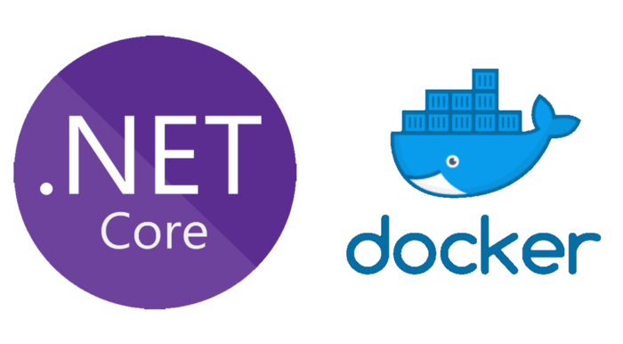
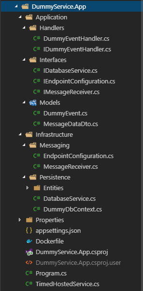

In this article, you will see how to prepare your backend service written in .Net Core for Docker, create docker image, run acceptance tests against your code and use of docker compose.



## Pre-requisites

Docker and docker-compose should be installed on your machine and any code editor of your choice. In this article, we will be targeting linux machines and create linux based images only. So either you need to have linux host machine or should switch to linux containers on windows machine. Other than this you should have an azure subscription to create servicebus and you should be familiar with its working and basic stuffs only. We can used rabbitMQ in a container locally but this is not what we are building in this application.

## Introduction

In this demo, we will create a .Net Core service which will listen to Azure Servicebus Topic and after processing events, it will update event information in a SQL Server for linux. All images are targeting linux environment and prepared for the same. See the architecture diagram for more details.


If you are already experienced with developing such services, you can jump right on step #4 and start from there. But I would suggest to read this article thoroughly as I have explained some key points and talked about onion architecture. And If you are stuck anywhere just go to the github repository and see the code. [Here](https://github.com/iqans/service-testing-docker-poc)

## Steps

### Step 1: Prepare service to run in a container

This step is fundamental step to get a service running in a docker container. In .Net Framework we have a project type called “Windows Service”. But there is no special project type available for .Net Core. All apps are basically a console app.

Here we will use console app project only. So first create a new .Net Core console application project. You will get a csproj file and Program.cs.

We will write code for building a generic host and run it async forever. This method will not let container die and backend processes can do their work.

```csharp

class Program
{
    public static async Task Main(string[] args)
    {
        var hostBuilder = new HostBuilder()
            .ConfigureAppConfiguration((hostContext, configBuilder) =>
            {
                configBuilder.SetBasePath(Directory.GetCurrentDirectory());
                configBuilder.AddJsonFile("appsettings.json", optional: true);
                configBuilder.AddJsonFile(
                    $"appsettings.{hostContext.HostingEnvironment.EnvironmentName}.json",
                    optional: true);
                configBuilder.AddEnvironmentVariables();
            })
            .ConfigureLogging((hostContext, configLogging) =>
            {
                configLogging.AddConfiguration(hostContext.Configuration.GetSection("Logging"));
                configLogging.AddConsole();
            })
            .ConfigureServices((hostContext, services) =>
            {
                // Here goes your internal application dependencies
                // like EntityFramework context, worker, endpoint, etc.
            });

        await hostBuilder.RunConsoleAsync();
    }
}

```

This piece of code will create a generic host, add some basic features like configuration and logging. Please remember to pull required packages from nuget related to logging, configuration, dependency injection,etc. I have struggled a lot resolving dependencies because they all are in separate nuget packages.

- **Microsoft.EntityFrameworkCore**: Is used to work with SQL Server database in this project. It is used to inject dependency of database context in dependencies container.
- **Microsoft.Extensions.Configuration**: Is used to read configurations from different sources like JSON files, environment variables, etc. For sources you will need separate nuget package. For example, to read from JSON file you will need to add Microsoft.Extensions.Configuration.Json package.
- **Microsoft.Extensions.DependencyInjection**: Provides basic functionalities for dependency injection. It is used to register dependencies and life cycles here.
- **Microsoft.Extensions.Hosting**: Is used to build a generic host and run it forever.
- **Microsoft.Extensions.Logging**: Is used to add logging in app. We are logging in console for this project. Also add Microsoft.Extensions.Logging.Console for logging in console.

First part is about adding configuration in host. We are using **appSettings.json** file and environment variables in this app. It goes by precedence. Environment variables will override any configuration here. We will be assigning some environment variables with while running docker containers.

Secondly, we add logging. Logging configuration like log file path, level, etc. are defined in configuration file. We will be writing logs in console for this app.

Services are nothing but internal project dependencies. You can add database context, worker and endpoint dependencies. We will update this section when we have our interfaces and implementations ready for this service.

### Step 2: Setup timed worker

A timed worker or host is nothing but a simple timer which runs certain tasks at defined interval of time. We will run service continuously but If you want to add certain time gap between processes, you can add in here. So create a new class same as below.

```csharp

public class TimedHostedService : IHostedService, IDisposable
{
    private readonly ILogger _logger;
    private Timer _timer;

    public TimedHostedService(ILogger<TimedHostedService> logger)
    {
        _logger = logger;
    }

    public Task StartAsync(CancellationToken cancellationToken)
    {
        _logger.LogInformation("Service is starting.");

        _timer = new Timer(DoWork, null, TimeSpan.Zero,
            TimeSpan.FromSeconds(5));

        return Task.CompletedTask;
    }

    private void DoWork(object state)
    {
        _logger.LogInformation("Service is running.");
    }

    public Task StopAsync(CancellationToken cancellationToken)
    {
        _logger.LogInformation("Service is stopping.");

        _timer?.Change(Timeout.Infinite, 0);

        return Task.CompletedTask;
    }

    public void Dispose()
    {
        _timer?.Dispose();
    }
}

```

This TimedHostedService will inherit from IHostedService so it needs to implement Start and Stop functions. We are adding logging dependency through constructor injection here.

**StartAsync:**

This method will be called when we run the host from Main method. It initializes a timer for defined time (5 seconds here) and runs DoWork on every time interval.

**StopAsync:**

This method is called when host is shut down. This method doesn’t do much yet. But we can add some features like unsubscribe from endpoints, complete in-progress transactions and shut down gracefully.

**DoWork:**

This method does all work that we intend our service to do. We write code for actual process here and it will be run at every interval of time. For now, it will just log something in console every 5 seconds.

Now, let’s register dependency in Program.cs file.

`services.AddScoped<IHostedService, TimedHostedService>();`

This statement will register dependency of IHostedService. Now the host is ready. You can run the app and see that console will show up and it will log some message every five seconds.

Next step is adding business functionality in application. Here in dummy application we will receive message from Servicebus Topic and insert message data in a sql database.

### Step 3: Add functionality to subscribe to Azure Servicebus Topic and Insert message data in Database

This is how complete app structure will look like once all components are in place.



If you are familiar with Onion Architecture, this app is an example of it. Not all aspects, but it covers most.

In this architecture, you have a core which holds business logic and domain entities. Then application layer above core which usually interacts with outer entities. We define all interfaces here or in domain so that we can invert dependencies. If you are a bit confused, don’t worry this is not in the scope current project and what we are trying to do here. But I’ll briefly explain what these layers do in this app.

**Application:**

This layer holds domain entities and event handler. Models are for event message what we will send and receive from Azure servicebus topic. Dto is simply converting domain entities into database entities. Handler is main module where actual event handling is done. Handler will delegate all tasks but have control on what what needs to be done and by whom. In this application handler will simply insert message data in database.

**Infrastructure:**

This layer handles all work to be done outside the boundary of application. It will take care of receiving events from Azure servicebus and also interact with sql database.

### Step 4: Add Dockerfile and build image for service

To build an docker image, you will need a Dockerfile. Docker engine uses this file to build image which can be run on any host having docker engine. So let’s create a Dockerfile. It should be in project folder, alongside csproj file. This is the sample used in this project.

```dockerfile

FROM microsoft/dotnet:2.2-runtime-stretch-slim AS base
WORKDIR /app

FROM microsoft/dotnet:2.2-sdk-stretch AS build
WORKDIR /src
COPY ["DummyService.App/DummyService.App.csproj", "DummyService.App/"]
RUN dotnet restore "DummyService.App/DummyService.App.csproj"
COPY . .
WORKDIR "/src/DummyService.App"
RUN dotnet build "DummyService.App.csproj" -c Release -o /app

FROM build AS publish
RUN dotnet publish "DummyService.App.csproj" -c Release -o /app

FROM base AS final
WORKDIR /app
COPY --from=publish /app .
ENTRYPOINT ["dotnet", "DummyService.App.dll"]

```

I have created this image as multistage. First stage will copy source code and build. Second stage will export binaries (.dlls) and third one will simply run app from binaries. You can use single stage also to make process simpler.

First you need to tell docker which base image you want for this app. Base image is nothing but like an operating system on which we can add tools and framework that helps in running this application. We are using dotnet image from microsoft, which contains dotnet core on a linux based system.

Next copy your code from source directory to container. Container is a running image. In build process all steps are performed in intermediate containers based on base image. Then build project which will generate binaries (dlls).

At last, copy this image to final stage and define entrypoint to run our application.

Once all set, we are ready to build the image. Open any terminal, and go to project directory and run

`docker build -t dummyservice .`

- `docker build` is command to run build.

- `-t dummyservice` is an argument which tells assign name dummyservice to the image

- `.` means current directory. It will use is as context for this build process

Once build succeeds, you can check images on your machine using `docker image ls` command. You should see dummyservice image there.

### Step 5: Run the application in container

Every thing should be setup now and ready to be run. But we have not done anything about our database or servicebus topic. So create a new servicebus and topic and get connectionStrings. For database you can either start a local sql server and use it’s connectionString or go to step #6 and see how to create a sql server container.

To run application

```sh

docker run -it — name container1 -e “EndpointConfiguration:ConnectionString=<your-servicebus-connectionstring>” -e “EndpointConfiguration:Topic=<your-topic-name>” -e “EndpointConfiguration:Subscription=<your-subscription-name>” -e “ConnectionStrings:DummyDatabase=Server=<your-db-connectionstring>” dummyservice

```

Replace configuration values with your actual values here.

- `docker run` tells docker engine to run an image
- `-it` is a switch which tells to run container in interactive mode so that we can see any errors or logs on screen
- `— name` tells docker to run container with this name
- `-e “KEY=VALUE”` sets environment variables for container. This will override any value provided in appSettings.json
- `dummyservice` at the end specifies which image to run

So if everything goes well, you should be in container shell and seeing logs. Now send a message on servicebus topic and you should see the data inserted in your database table.

### Step 6: SQL Database in docker container

In this step, we will be creating an image for database. So when we run this image, we will get a fresh SQL server with your database and tables available.

```dockerfile

FROM microsoft/mssql-server-linux

RUN mkdir /work

COPY CreateDb.sql /work
COPY db.sh /work
COPY db.bak /work

WORKDIR /work

RUN chmod 755 db.sh

RUN ./db.sh CreateDb.sql

```

Docker file has base image as mssql-server-linux from microsoft. This will create a sql server. Rest of the steps are to create our database in this sql server. We have two more scripts to do so as below.

```sh

echo "Setting Environment variables."
export ACCEPT_EULA=Y
export SA_PASSWORD=SuperSecretPassword#1
echo "Environment variables set."
echo "Starting SqlServr"
/opt/mssql/bin/sqlservr &
sleep 60 | echo "Waiting for 60s to start Sql Server"
echo "Restoring DB."
/opt/mssql-tools/bin/sqlcmd -U sa -P SuperSecretPassword#1 -i $1
echo "DB restored."

```

This shell script will connect to the sql server and execute a sql script on it.

```sql

USE master
GO
RESTORE DATABASE DummyDatabase 
FROM DISK = '/work/db.bak' WITH 
MOVE 'DummyDatabase' TO '/var/opt/mssql/data/DummyDatabase/DummyDatabase.mdf',
MOVE 'DummyDatabase_log' TO '/var/opt/mssql/data/DummyDatabase/DummyDatabase_log.ldf'

```

This sql script will take a sql database backup file (.bak) and restore in this new sql server. You can modify the backup file as per your schema and database requirements.

Once all files and scripts are in place, we can build the image.

`docker build -t dummydatabase .`

Hope all is clear with what the above command does to build an image.

Once image is built, run it.

```sh

docker run -it — name -e “SA_PASSWORD=<super-secret-password>” -p 1433:1433 container2 dummydatabase

```

- `-p` is used to forward port. Sql server will run on port 1433 but in a container. So you need to map it to a host port. Otherwise host will not be able to access the server

There is a small problem with this mssql-server-linux, it requires a strong password (uppercase, lowercase, number, symbol and length min 8). If you do not specify proper password, your database container will die immediately and you will be clueless thinking what went wrong. But if everything goes all well, you can connect to this database

### Step 7: Run both application and database with docker-compose

Compose is a tool which can run multiple containers. It requires a YAML file which tells compose to run containers with configuration.

```yml

version: '3.4'

services:
  dummyservice.app:
    image: iqan/dummyserviceapp
    build:
      context: .
      dockerfile: DummyService.App/Dockerfile
    environment:
      - EndpointConfiguration:ConnectionString=<your-servicebus-connectionstring>
      - EndpointConfiguration:Topic=<your-topic-name>
      - EndpointConfiguration:Subscription=<your-subscription-name>
      - ConnectionStrings:<your-db-connectionstring>
    depends_on:
      - db
  db: 
    image: "iqan/dummydatabase"
    build:
      context: .
      dockerfile: DummyDatabase/Dockerfile
    environment:
      - SA_PASSWORD=SuperSecretPassword#1
      - ACCEPT_EULA=Y

```

### Step 8: Add AcceptanceTests project and write testcases

In this step, we will add a new project for acceptance tests and write a simple testcase which will validate if the service is behaving properly or not. Acceptance testing is nothing but Black-box testing. In this project, I have used xUnit and BDDfy. We will send a message on Azure servicebus topic and wait for service to process it. After a few seconds, we will check in database if a record is created or not. Testcase passes when it finds message which was sent is inserted in database table.

I am not going to explain everything like how to write testcases and setup such project. You can refer to code in repository.

```csharp

[Story(
    Title = "DummyEvent is handled",
    AsA = "As a dummy service",
    IWant = "I want to handle dummy event",
    SoThat = "So that I can get message data inserted in database")]
public class DummyEventHandlingFeature
{
    private IDictionary<string, string> _inMemoryStorage = new Dictionary<string, string>();

    [Fact]
    public void Vanilla()
    {
        this.Given(_ => IHaveServiceRunning())
            .When(_ => ISendDummyEvent())
            .Then(_ => IShouldGetMessageDataInsertedInDatabase())
            .BDDfy("Vanilla case");
    }

    private void IHaveServiceRunning()
    {
        DeleteAllExistingData();
    }

    private void ISendDummyEvent()
    {
        var text = "Some dummy text";
        var message = new Message(System.Text.Encoding.UTF8.GetBytes(text));
        SendMessage(message);
        _inMemoryStorage.Add("text", text);
    }

    private void SendMessage(Message message)
    {
        var connectionString = ConfigurationReader.GetConfigValueFor("EndpointConfiguration:ConnectionString");
        var topic = ConfigurationReader.GetConfigValueFor("EndpointConfiguration:Topic");

        var client = new TopicClient(connectionString, topic);
        client.SendAsync(message).GetAwaiter().GetResult();
    }

    private void IShouldGetMessageDataInsertedInDatabase()
    {
        System.Threading.Thread.Sleep(5000);
        
        var expectedText = _inMemoryStorage["text"];

        var messageData = GetMessageData();

        messageData.Should().NotBeNull();
        messageData.MessageText.Should().Be(expectedText);

        DeleteAllExistingData();
    }

    private MessageData GetMessageData()
    {
        var options = DbHelper.GetDbContextOptions();
        using (var context = new DummyDbContext(options))
        {
            return context.MessageDatas.FirstOrDefault();
        }
    }

    private static void DeleteAllExistingData()
    {
        var options = DbHelper.GetDbContextOptions();
        using (var context = new DummyDbContext(options))
        {
            context.MessageDatas.RemoveRange(context.MessageDatas);
            context.SaveChanges();
        }
    }
}

```

Once test project is setup, test it and see if everything is in place.

### Step 9: Add Dockerfile and build image for tests

It will be exactly same as the service. Only the project name and some configuration will be changing.

```dockerfile

FROM microsoft/dotnet:2.1-runtime-stretch-slim AS base
WORKDIR /app

FROM microsoft/dotnet:2.1-sdk-stretch AS build
WORKDIR /src
COPY ["DummyService.AcceptanceTests/DummyService.AcceptanceTests.csproj", "DummyService.AcceptanceTests/"]
RUN dotnet restore "DummyService.AcceptanceTests/DummyService.AcceptanceTests.csproj"
COPY . .
WORKDIR "/src/DummyService.AcceptanceTests"
RUN dotnet build "DummyService.AcceptanceTests.csproj" -c Release -o /app

FROM build AS test
RUN chmod 777 wait-for-it.sh

# Comment out below line when using docker-compose
ENTRYPOINT ["dotnet", "test", "DummyService.AcceptanceTests.csproj"]

```

You may have noticed a small change. We are copying a shell script and providing execute permissions on it. This is not required for now. But this is most important part when we use docker compose and run all containers in a single go. That shell script does nothing much. It will wait for a service to be started on particular port and then it will run whatever application we intend to run in this container.

### Step 10: Run all images using docker compose

In this step, we will create a YAML file which compose will use for running images. Now we need to define configuration steps.

- Define database image and configure it
- Define service image and configure it
- Define tests image and configure it

```yml

version: '3.4'

services:
  dummyservice.app:
    image: iqan/dummyserviceapp
    build:
      context: .
      dockerfile: DummyService.App/Dockerfile
    environment:
      - EndpointConfiguration:ConnectionString=<your-servicebus-connectionstring>
      - EndpointConfiguration:Topic=<your-topic-name>
      - EndpointConfiguration:Subscription=<your-subscription-name>
      - ConnectionStrings:<your-db-connectionstring>
    depends_on:
      - db
  db: 
    image: "iqan/dummydatabase"
    build:
      context: .
      dockerfile: DummyDatabase/Dockerfile
    environment:
      - SA_PASSWORD=SuperSecretPassword#1
      - ACCEPT_EULA=Y
  dummyservice.tests:
    image: iqan/dummyservicetests
    build:
      context: .
      dockerfile: DummyService.AcceptanceTests/Dockerfile
    environment:
      - EndpointConfiguration:ConnectionString=<your-servicebus-connectionstring>
      - EndpointConfiguration:Topic=<your-topic-name>
      - EndpointConfiguration:Subscription=<your-subscription-name>
      - ConnectionStrings:<your-db-connectionstring>
    depends_on:
      - db
      - dummyservice.app
    command: ["./wait-for-it.sh", "db:1433", "-t", "30", "--", "dotnet", "test", "DummyService.AcceptanceTests.csproj"]

```

Notice we have depends_on field which tells compose to start container only once the dependent service is running. For tests, we are specifying command here to run. It will call shell script which will wait for database to start and be available on port 1433. After database is available and service container is running, it will start executing tests.

To run execute:

`docker-compose up — exit-code-from dummyservice.tests`

- `— exit-code-from` tells compose when to exit and take down all containers. We are specifying test here, so that once tests are executed, it will bring database and service down. If everything goes well you should see test passing.


That’s all. You have fully functional service and its sql database running in container. On top of that, you are executing testcases again in docker container. :)

## Wrap up

So far, we have seen how to prepare a .Net Core service to run in container. How to get sql database running in container with schema and fresh data. Also we have looked at running tests against it.

So when you add new features in service, all you have to do is run docker compose and your service will be tested properly and you will find any bugs quickly as all containers run on proper isolated data and code.

Feel free to fork and send pull request for any changes you feel like doing in repository. [https://github.com/iqans/service-testing-docker-poc](https://github.com/iqans/service-testing-docker-poc)
