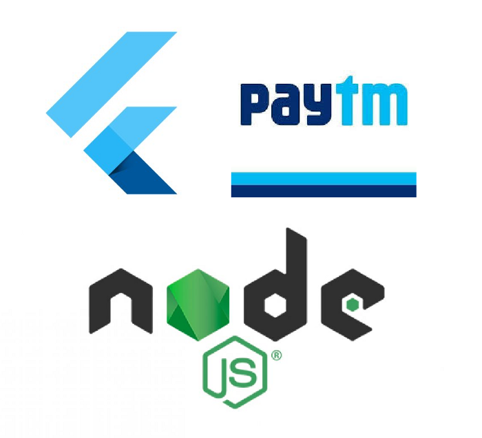
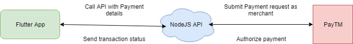

Flutter is a cross-platform app development platform by Google. It’s been a while since first stable version came out flutter 1.0. It uses dart language developed by Google.

PayTM is an Indian e-commerce payment system and digital wallet provider. It’s very popular as payment wallet and most of the vendors accept payments via this medium.



## Introduction

In this guide, we will be making an app in flutter and do payment process for PayTM using a webview and NodeJS api as backend.

## Architecture



NodeJS API holds merchant ID and key. Flutter app will open a webview and navigate to API with order details. API will pass information to PayTM and initiate payment. Then payments can be done on PayTM website. Once done, API will return JSON response about transaction status. Then in flutter app, user will be notified for payment completion.

## Steps

### Step 1 — Create a PayTM merchant account

Go to [https://dashboard.paytm.com/](https://dashboard.paytm.com/) and create an account.
Then fetch merchant id and keys from [https://dashboard.paytm.com/next/apikeys](https://dashboard.paytm.com/next/apikeys)

### Step 2 — Set up NodeJS API

For PayTM, there is a need of checksum. It is a unique string value generated based on certain logic. PayTM SDKs have this implementation for various platforms.

One more benefit of using API is you don’t need to distribute sensitive information in APP like Merchange ID or Key. Plus with API you can use it for mobile apps as well as web app.

We are using NodeJS, so I have grabbed NodeJS SDK for PayTM and added in demo API. This API exposes only one endpoint which is to initiate payment. Rest of the process is done through PayTM payments pages.
Clone the repository from: [https://github.com/iqans/paytm-checksum-api-nodejs](https://github.com/iqans/paytm-checksum-api-nodejs)

Update appConfig.config with your details:

```dart

const appConfig = {
  port: process.env.PORT || 3000,
  hostUrl: process.env.HOST_URL || `http://your-local-machine-ip`
};

var paytmConfig = {
  mid: process.env.PAYTM_MERCH_ID || '<YOUR_MERCHANT_ID_HERE>',
  key: process.env.PAYTM_MERCH_KEY || '<YOUR_MERCHANT_KEY_HERE>',
  website: process.env.PAYTM_MERCH_WEBSITE || 'WEBSTAGING',
  transactionUrl: process.env.PAYTM_TXN_URL || 'https://securegw-stage.paytm.in/theia/processTransaction',
  hostName: process.env.PAYTM_HOST || 'securegw-stage.paytm.in'
};

```

Run api using `npm run start`

### Step 3 — Make changes in Flutter APP

There is no stable and battle tested flutter plugin available at the time of writing this. PayTM has SDKs for native android and iOS. So if you need to integrate that you may need to create a platform channel and invoke it from flutter code. This is good approach with better UX but lengthy one.

In this demo app, I have used flutter webview plugin. With help of Node API, we can initiate payment and do transaction from webview. Here in this app, only thing you will need is to setup webview and handle response for transations.

Now, clone the repository from: [https://github.com/iqans/flutter-paytm-webview](https://github.com/iqans/flutter-paytm-webview)

Update Settings.dart with your details:

```dart

class Settings {
  static String get apiUrl => "http://<IP-ADDRESS-OF-NODE-API>:3000/api/v1/paytm/initiatePayment";
}

```

For orders, modify details in Payment.dart:

```dart

final orderId = 'TEST_12345678';
final customerId = '12345678';
final amount = '1.0';
final email = 'abc@abc.com';

```

Now run the app in simulator or device using: `flutter run`

## To conclude

These demo repositories have enough code to handle vanilla flow and to test if everything is configured properly. You can add more features in API or even integrate same in another API as well.

For flutter app, you can use state management techniques to make code more clean, decoupled and log transactions in Firebase or local storage. In real world apps, customer details can be fetched from social logins or own identity server and orders can be created as per the logic. Once everything is in place, you can activate your PayTM merchant account following steps online and that’s all.

Thanks for reading! Have a great day ahead!
