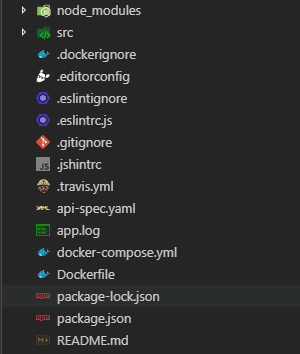

Introduction to a very simple and well structured node-express-mongo API starter

This article is more about structuring a node API properly. There are many templates available. Some follow model-view-presenter pattern, some say MVC or MVVM or some don’t use any pattern and write everything in a folder called routes. This template will help you get quickly started with rest api development as most of the setup is already there.
In this template, no additional libraries (other than fundamental ones) are used. This template shows better separation of code and logic. So let’s see what the template contains.

This is the basic structure of app when you clone the repository. All the API related code will go inside src folder.

> This is what source folder contains.

- **api**: will contain all the routes, controllers, data repository, entities
bin: just a startup point from where server starts
- **config**: application config files goes here
- **db**: database related connections and objects are placed here
- **logging**: logging mechanism for app. Currently app has log4j.
- **test**: contains all tests for features.
- **others**: app.js and app.middleware.js is used to setup express app and middlewares.
- **swagger files**: swagger is used for specification and documentations. yaml file can be modified and you can see specs in swagger-ui.

> Now let’s take a look at what goes inside api directory.

api directory will contain version-wise folders. inside that feature-wise folders are created so that it can be easily move to another application if required. For example, if you need to remove a feature from api, you do not need to look into many folders and delete files related to the feature. You simply delete the directory and remove route reference.

- **xyz.router.js**: will contain route information and controller method binding
- **xyz.controller.js**: will contain logic for each route-method and is responsible for handling requests and sending reponses
- **xyz.dao.js**: will contain code for database interactions
- **xyz.entity.js**: will contain mongoose entities for database model
- **xyz.services.js**: if there are any other interactions or responsibility, this file will hold the code for that

> Let’s see how to add a new feature.

If you have a user feature which contains code for login and registration, you can add it like this:
api -> v1 -> users ->users.controller.js, users.router.js, users.entity.js, users.dao.js, etc.

> Add a new directory here: api -> v1 -> users

- **users.controller.js**: add methods to handle login and registration request
- **users.router.js**: map routes like ‘/login’, ‘/register’ with appropriate controller methods
- **users.dao.js**: add methods for user creation and authentication (email and password)
- **users.entity.js**: add mongoose schema model for users like email(string, unique) and password(string)

Clone this repository and use it. If you feel like contributing, please fork it and send a pull request.
