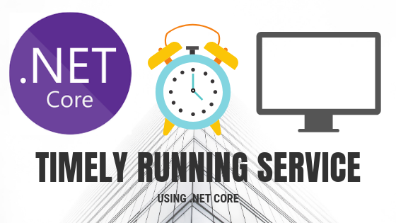

There are certain scenarios where a service or job is needed to do background processing. In .NET Framework world, only way to create such service is to use a Windows Service project template. This service can only be installed on a windows server. But if you want to use a linux or docker host, you may want to use .NET Core.



.NET Core doesn’t provide a project which is similar to Windows Service. So we need to create a console app and make it to behave as a backend service. So let’s get started.

## Create a new service with generic host

Here we will use console app project only. So first create a new .Net Core console application project. You will get a csproj file and Program.cs.

We will write code for building a generic host and run it async forever. This method will not let container die and backend processes can do their work.

```csharp

class Program
{
    public static async Task Main(string[] args)
    {
        var hostBuilder = new HostBuilder()
            .ConfigureAppConfiguration((hostContext, configBuilder) =>
            {
                configBuilder.SetBasePath(Directory.GetCurrentDirectory());
                configBuilder.AddJsonFile("appsettings.json", optional: true);
                configBuilder.AddJsonFile(
                    $"appsettings.{hostContext.HostingEnvironment.EnvironmentName}.json",
                    optional: true);
                configBuilder.AddEnvironmentVariables();
            })
            .ConfigureLogging((hostContext, configLogging) =>
            {
                configLogging.AddConfiguration(hostContext.Configuration.GetSection("Logging"));
                configLogging.AddConsole();
            })
            .ConfigureServices((hostContext, services) =>
            {
                // Here goes your internal application dependencies
                // like EntityFramework context, worker, endpoint, etc.
            });

        await hostBuilder.RunConsoleAsync();
    }
}

```

This piece of code will create a generic host, add some basic features like configuration and logging. Please remember to pull required packages from nuget related to logging, configuration, dependency injection,etc. I have struggled a lot resolving dependencies because they all are in separate nuget packages.

- **Microsoft.Extensions.Configuration**: Is used to read configurations from different sources like JSON files, environment variables, etc. For sources you will need separate nuget package. For example, to read from JSON file you will need to add `Microsoft.Extensions.Configuration.Json` package.
- **Microsoft.Extensions.DependencyInjection**: Provides basic functionalities for dependency injection. It is used to register dependencies and life cycles here.
- **Microsoft.Extensions.Hosting**: Is used to build a generic host and run it forever.
- **Microsoft.Extensions.Logging**: Is used to add logging in app. We are logging in console for this project.

First part is about adding configuration in host. We are using **appSettings.json** file and environment variables in this app. It goes by precedence. Environment variables will override any configuration here. We will be assigning some environment variables with while running docker containers.

Secondly, we add logging. Logging configuration like log file path, level, etc. are defined in configuration file. We will be writing logs in console for this app.

Services are nothing but internal project dependencies. You can add database context, worker and endpoint dependencies. We will update this section when we have our interfaces and implementations ready for this service.

## Setup timed worker

A timed worker or host is nothing but a simple timer which runs certain tasks at defined interval of time. We will run service continuously but If you want to add certain time gap between processes, you can add in here. So create a new class same as below.

```csharp

public class TimedHostedService : IHostedService, IDisposable
{
    private readonly ILogger _logger;
    private Timer _timer;

    public TimedHostedService(ILogger<TimedHostedService> logger)
    {
        _logger = logger;
    }

    public Task StartAsync(CancellationToken cancellationToken)
    {
        _logger.LogInformation("Service is starting.");

        _timer = new Timer(DoWork, null, TimeSpan.Zero,
            TimeSpan.FromSeconds(5));

        return Task.CompletedTask;
    }

    private void DoWork(object state)
    {
        _logger.LogInformation("Service is running.");
    }

    public Task StopAsync(CancellationToken cancellationToken)
    {
        _logger.LogInformation("Service is stopping.");

        _timer?.Change(Timeout.Infinite, 0);

        return Task.CompletedTask;
    }

    public void Dispose()
    {
        _timer?.Dispose();
    }
}

```

This TimedHostedService will inherit from IHostedService so it needs to implement Start and Stop functions. We are adding logging dependency through constructor injection here.

**StartAsync:**

This method will be called when we run the host from Main method. It initializes a timer for defined time (5 seconds here) and runs DoWork on every time interval.

**StopAsync:**

This method is called when host is shut down. This method doesn’t do much yet. But we can add some features like unsubscribe from endpoints, complete in-progress transactions and shut down gracefully.

**DoWork:**

This method does all work that we intend our service to do. We write code for actual process here and it will be run at every interval of time. For now, it will just log something in console every 5 seconds.

Now, let’s register dependency in Program.cs file.

`services.AddScoped<IHostedService, TimedHostedService>();`

This statement will register dependency of IHostedService. Now the host is ready. You can run the app and see that console will show up and it will log some message every five seconds.

That’s it. You have your service setup. Now you can add more features in it or do anything you like in DoWork method.

If you need code for reference, checkout the repository. [https://github.com/iqans/service-testing-docker-poc/tree/master/src/DummyService.App](https://github.com/iqans/service-testing-docker-poc/tree/master/src/DummyService.App)

Thanks for reading. Have a great day ahead :)
